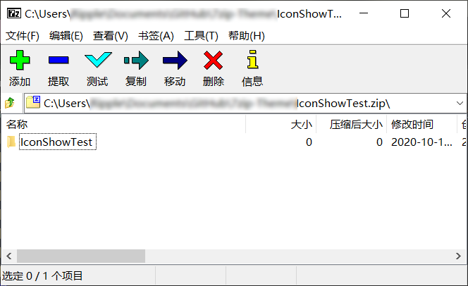
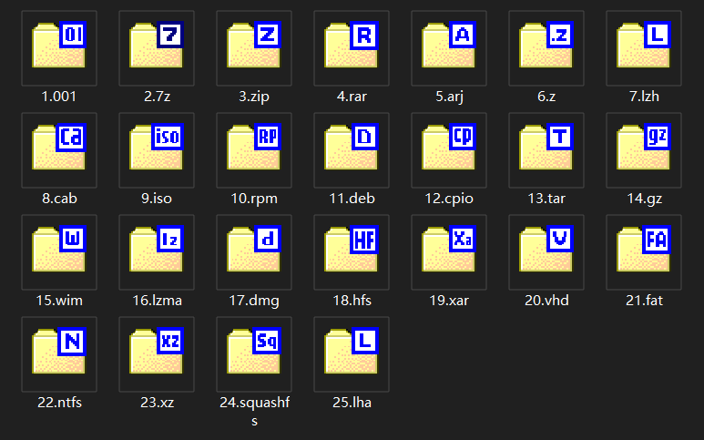

<p align="center">
  
</p>

# <p align="center">7zip Theme</p>


:earth_asia: [English](./readme.md) | [中文](./readme_cn.md) 

<br/>

**Content**

---

<a href="#usefor">What is this for?</a> 

<a href="#works">How it works?</a> 

<a href="#preview_download">1. Icon Preview and Download</a> 

​    <a href="#fileIcons">1.1 File Icons</a> 

​    <a href="#toolbarIcons">1.2 Toolbar Icons</a> 

<a href="#register">2. Register</a> 

<a href="#declaration">3. Declaration</a> 

<br/>

<a id="usefor"/>

## What is this for :question:

This repository contains a collection of `zip file icon sets` for Windows, as well as `toolbar replacement icon sets` specifically for [7-zip](https://www.7-zip.org/) software.

As we all know, 7-Zip is an open source, free, high compression ratio file archiver software.

7-zip author Igor Pavlov designed toolbar icons and folder icons for the purpose of making the software extremely small.

I would like to thank Igor Pavlov for making such a great software.  :love_letter: 

Meanwhile, people follow the reputation of 7-zip and install it, they are ready to have a good time.

However, people find that these native icons don't seem to satisfy their aesthetic sense.

Let's take a look at these icons, :arrow_down: :arrow_down: :arrow_down: , they do look as if they don't quite fit the Windows style.

  

Therefore, there are many beauty lovers in this world who make icons that they think look good.

If you like it too, you can find the corresponding resources, and their usage, from below! :clap: :clap: :clap: 

<br/>

<a id="works"/>

## :astonished: How it works ？

:one: Go to [7-zip](https://www.7-zip.org/) official website and download the Windows 64-bit installation file and install it to your computer.

:two: Find and download the patch file for your favorite icon set (file icon or toolbar icon) below;

:three: Copy the downloaded 7z.dll or 7zFM.exe file to the location where you installed 7-zip and replace the original file;
<br/>

> :warning: You should first backup the original 7z.dll and 7zFM.exe files.
> 
> :warning: Make sure you download a version of the patch file that matches the version of 7-zip you have installed.
> 
> :+1: If you don't know which one to choose, I recommend the Windows 10 Default and Glyfz 2016 combo, I've added :heart_eyes: to their titles and they look like this :arrow_down: 
> 
>  
> 
> :space_invader:For `non-Windows` users, if you are interested, you can download your favorite icon set or fork this repository and make your own patch file :smile: 

<br/>

<a id="preview_download"/>

## 1. Icon Preview and Download

<a id="fileIcons"/>

### 1.1 File Icons

> Each ico format icon in each file icon set contains a composite of 7 icons in sizes 256x256, 64x64, 48x48, 32x32, 24x24, 20x20, 16x16.
>
> Some icons are also available in PSD design files.

#### 1.1.01 Windows 10 Blue

 

Icon Group: [Download](./Filetype/Windows%2010%20Blue.zip) 

#### 1.1.02 Windows 10 Default by_d93yxyk :heart_eyes:

 

Icon Group: [Download](./Filetype/Windows%2010%20Default%20by_d93yxyk.zip)  

Patch: [1900x64](./7z1900x64%20patch/7z.dll) &nbsp;&nbsp; [2107x64](./7z2107x64%20patch/7z.dll) &nbsp; [2201x64](./7z2201x64%20patch/7z.dll) &nbsp; [2409x64](./7z2409x64_patch/7z.dll) 

#### 1.1.03 7-Zip Original filetype

 

Icon Group: [Download](./Filetype/7-Zip%20Original%20filetype.zip) 

<br/>

<a id="toolbarIcons"/>

### 1.2 Toolbar Icons

> Each toolbar icon set, containing 48x36 and 24x24 icons, and including the theme.ini file, can be used with the [7-zip Theme Manager (7zTM)](http://www.7ztm.de/) software.

#### 1.2.01 Gion

 

Icon Group: [Download](./Toolbar/Gion.zip) 

#### 1.2.02 Glyfz 2016 :heart_eyes:

 

Icon Group: [Download](./Toolbar/Glyfz%202016.zip) 

Patch: [1900x64](./7z1900x64%20patch/7zFM.exe) &nbsp;&nbsp; [2107x64](./7z2107x64%20patch/7zFM.exe) &nbsp;  [2201x64](./7z2201x64%20patch/7zFM.exe) &nbsp;  [2409x64](./7z2409x64_patch/7zFM.exe) 

#### 1.2.03 Nuvola

 

Icon Group: [Download](./Toolbar/Nuvola.zip) 

#### 1.2.04 Office 2013_by_d93yyju

 

Icon Group: [Download](./Toolbar/Office%202013_by_d93yyju.zip) 

#### 1.2.05 Pure

 

Icon Group: [Download](./Toolbar/Pure.zip) 

#### 1.2.06 Windows 10 Blue

 

Icon Group: [Download](./Toolbar/Windows%2010%20Blue.zip) 

#### 1.2.07 Windows 10 Default

 

Icon Group: [Download](./Toolbar/Windows%2010%20Default.zip) 

#### 1.2.08 Windows 10 by c3powen d9z0bsg

 

Icon Group: [Download](./Toolbar/Windows%2010%20by%20c3powen%20d9z0bsg.zip) 

#### 1.2.09 Oxygen 2

 

Icon Group: [Download](./Toolbar/Oxygen%202.zip) 

#### 1.2.10 Oxygen 4

 

Icon Group: [Download](./Toolbar/Oxygen%204.zip) 

#### 1.2.11 Oxygen Refit

 

Icon Group: [Download](./Toolbar/Oxygen%20Refit.zip) 

#### 1.2.12 7-Zip Original

 

Icon Group: [Download](./Toolbar/7-Zip%20Original%20Toolbar%20Theme.zip) 

<br/>

<a id="register"/>

## 2. Register


 

```register
Windows Registry Editor Version 5.00

[HKEY_CLASSES_ROOT\.lzma]
@="7-Zip.lzma"

[HKEY_CLASSES_ROOT\7-Zip.lzma]
@="7z Archive"

[HKEY_CLASSES_ROOT\7-Zip.lzma\DefaultIcon]
@="C:\\Program Files\\7-Zip\\7z.dll,16"

[HKEY_CLASSES_ROOT\7-Zip.lzma\shell]
@=""

[HKEY_CLASSES_ROOT\7-Zip.lzma\shell\open]
@=""

[HKEY_CLASSES_ROOT\7-Zip.lzma\shell\open\command]
@=""
```


<br/>

<a id="declaration"/>

## 3. Declaration

1、The resources related to this software are collected from the Internet, and the copyright belongs to its developer and author.

2、This software is only for personal learning and communication, please do not use it for any kind of commercial use.

3、You must bear all possible consequences and losses caused by the use of the process.

4、If you have any comments or suggestions during the use, please provide feedback and correction in time.
