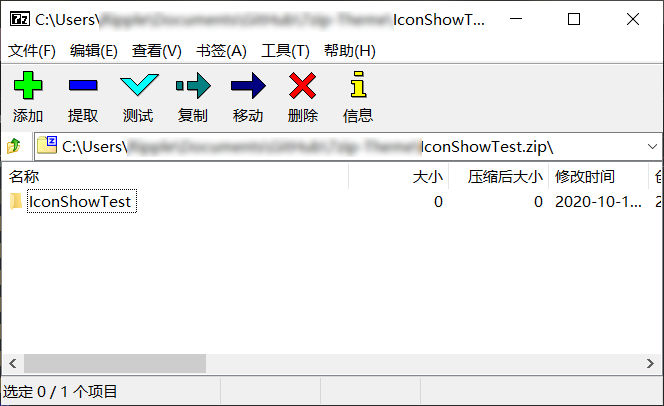
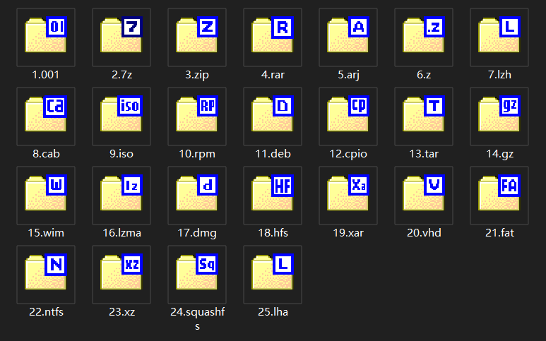
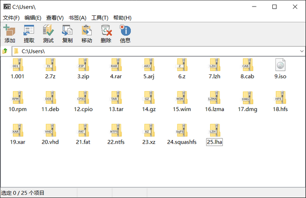
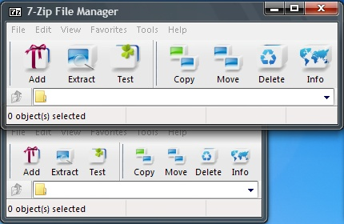
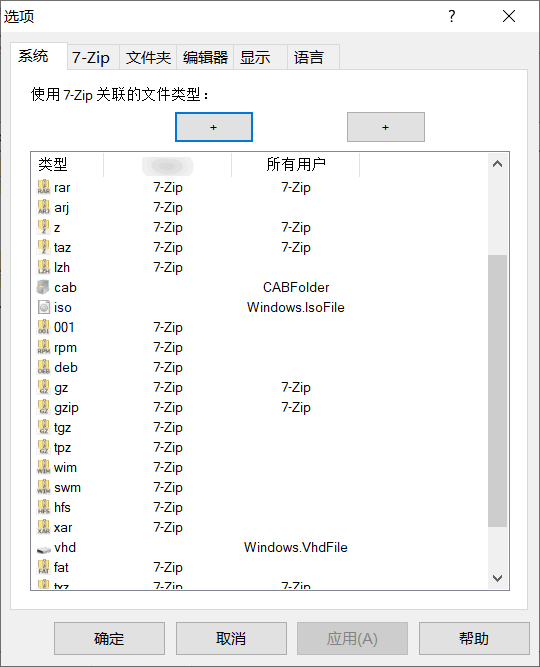

# <p align="center">7zip Theme</p>

:earth_asia: [English](./readme.md) | [中文](./readme_cn.md) 
<br/>

**目录**

---

<a href="#usefor">这是用来干什么的 ?</a> 

<a href="#works">如何使用 ?</a> 

<a href="#preview_download">1. 图标预览及下载</a> 

​    <a href="#fileIcons">1.1 文件图标</a> 

​    <a href="#toolbarIcons">1.2 工具栏图标</a> 

<a href="#register">2. 注册表</a> 

<a href="#declaration">3. 特别声明</a> 

<br/>

<a id="usefor"/>

## 这是用来干什么的 :question: 


这个仓库收集制作了一些 Windows 系统下的`压缩文件图标`，以及专门用于 [7-zip](https://www.7-zip.org/) 软件的`工具栏的替换图标`。

众所周知，7-zip 是一款开源免费且高质量的压缩/解压缩软件。然而当人们循着名声安装好 7-zip ，准备大呼过瘾的时候，却发现 7-zip 为了究极小巧而特意设计的工具栏图标和文件夹图标，好像并不能满足自己的美感。我们看看这些原生图标，:arrow_down: :arrow_down: :arrow_down: ，好像是差点意思。

  

因此，这个世界上有很多爱美的人制作了他们认为好看的图标。

如果你也喜欢，你可以从下方找到对应的资源，及其使用方法！:clap: :clap: :clap: 

<br/>

<a id="works"/>

## :astonished: 如何使用 ？


:one: 到 [7-zip](https://www.7-zip.org/) 官网下载 Windows 64 位的安装文件，并安装到你的电脑中；

:two: 在下方找到并下载你喜欢的图标组 ( 文件图标或工具栏图标 ) 补丁文件;

:three: 将下载好的 7z.dll 或 7zFM.exe 文件拷贝到你安装 7-zip 的地方，并替换原有文件;
<br/>

> :warning: 你最好先备份原有的 7z.dll 和 7zFM.exe 文件；
> 
> :warning: 请确保你下载的补丁文件版本，与你安装的 7-zip 版本相匹配；
> 
> :+1: 如果你不知道选哪个，我推荐你使用 Windows 10 Default 和 Glyfz 2016 组合，我在他们的标题上加了 :heart_eyes:  他们看起来是这样的:arrow_down: 
> 
>  
> 
> :space_invader: 对于`非 Windows `用户，如果你感兴趣，可以下载你喜欢的图标组，或fork此仓库，然后自己制作补丁文件:smile: 

<br/>

<a id="preview_download"/> 

## 1. 图标预览及下载

<a id="fileIcons"/> 

### 1.1 文件图标

> 每个文件图标组的每个 ico 格式图标，都复合包含了 256x256, 64x64, 48x48, 32x32, 24x24, 20x20, 16x16 共 7 中大小的图标。
>
> 部分图标还提供 PSD 格式的设计文件。

#### 1.1.01 Windows 10 Blue

 

Icon Group: [Download](./Filetype/Windows%2010%20Blue.zip) 

#### 1.1.02 Windows 10 Default by_d93yxyk :heart_eyes:

 

Icon Group: [Download](./Filetype/Windows%2010%20Default%20by_d93yxyk.zip)  

Patch: [1900x64](./7z1900x64%20patch/7z.dll) &nbsp;&nbsp; [2107x64](./7z2107x64%20patch/7z.dll) 

#### 1.1.03 7-Zip Original filetype

 

Icon Group: [Download](./Filetype/7-Zip%20Original%20filetype.zip) 

<br/>

<a id="toolbarIcons"/> 

### 1.2 工具栏图标

> 每个工具栏图标组，含有 48x36 和 24x24 两组图标，并且包含 theme.ini 文件，可用于 [7-zip Theme Manager (7zTM)](http://www.7ztm.de/) 软件。

#### 1.2.01 Gion

 

Icon Group: [Download](./Toolbar/Gion.zip) 

#### 1.2.02 Glyfz 2016 :heart_eyes:

 

Icon Group: [Download](./Toolbar/Glyfz%202016.zip) 

Patch: [1900x64](./7z1900x64%20patch/7zFM.exe) &nbsp;&nbsp; [2107x64](./7z2107x64%20patch/7zFM.exe) 

#### 1.2.03 Nuvola

 

Icon Group: [Download](./Toolbar/Nuvola.zip) 

#### 1.2.04 Office 2013_by_d93yyju

 

Icon Group: [Download](./Toolbar/Office%202013_by_d93yyju.zip) 

#### 1.2.05 Pure

 

Icon Group: [Download](./Toolbar/Pure.zip) 

#### 1.2.06 Windows 10 Blue

 

Icon Group: [Download](./Toolbar/Windows%2010%20Blue.zip) 

#### 1.2.07 Windows 10 Default

 

Icon Group: [Download](./Toolbar/Windows%2010%20Default.zip) 

#### 1.2.08 Windows 10 by c3powen d9z0bsg

 

Icon Group: [Download](./Toolbar/Windows%2010%20by%20c3powen%20d9z0bsg.zip) 

#### 1.2.09 Oxygen 2

 

Icon Group: [Download](./Toolbar/Oxygen%202.zip) 

#### 1.2.10 Oxygen 4

 

Icon Group: [Download](./Toolbar/Oxygen%204.zip) 

#### 1.2.11 Oxygen Refit

 

Icon Group: [Download](./Toolbar/Oxygen%20Refit.zip) 

#### 1.2.12 7-Zip Original

 

Icon Group: [Download](./Toolbar/7-Zip%20Original%20Toolbar%20Theme.zip) 

<br/>

<a id="register"/>

## 2. 注册表


 

```register
Windows Registry Editor Version 5.00

[HKEY_CLASSES_ROOT\.lzma]
@="7-Zip.lzma"

[HKEY_CLASSES_ROOT\7-Zip.lzma]
@="7z Archive"

[HKEY_CLASSES_ROOT\7-Zip.lzma\DefaultIcon]
@="C:\\Program Files\\7-Zip\\7z.dll,16"

[HKEY_CLASSES_ROOT\7-Zip.lzma\shell]
@=""

[HKEY_CLASSES_ROOT\7-Zip.lzma\shell\open]
@=""

[HKEY_CLASSES_ROOT\7-Zip.lzma\shell\open\command]
@=""
```

<br/>

<a id="declaration"/>

## 3. 特别声明


1、本软件相关资源收集自互联网，版权归其开发厂商及作者所有。

2、本软件仅限于个人学习交流，请勿用于任何形式商业用途。

3、您必须自行承担使用过程所有可能引起的后果及损失。

4、使用过程中若有意见或建议，请及时反馈和指正。
